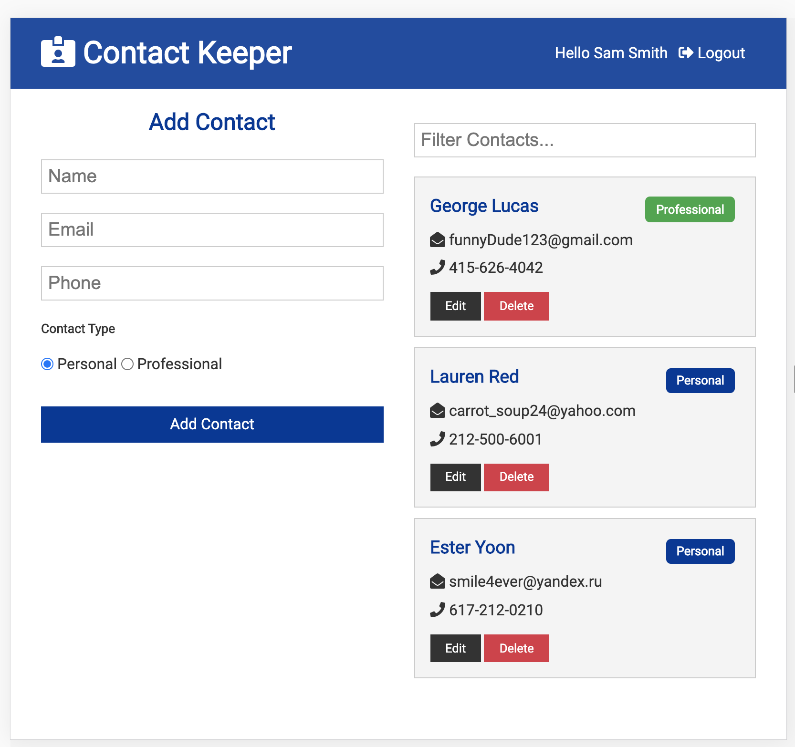
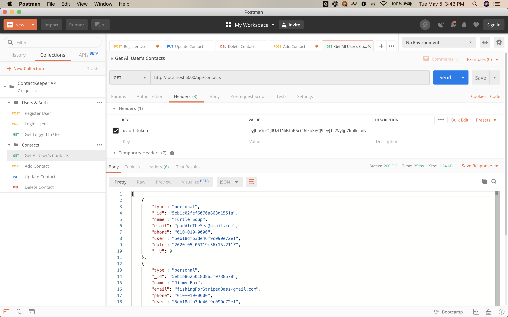

# Contact-Keeper---MERN

## Run the app
- `npm run dev`

## Build the app
- `npm run build` (from client folder) <!-- create production build; would need to do this everytime we want to deploy -->
### OR.... we can do a post-build on the server, after we deploy
- add this script to top-level (server) package.json: `"heroku-postbuild": "NPM_CONFIG_PRODUCTION=false npm install --prefix client && npm run build --prefix client"`
<!-- temporary turn off production; and for client: install dependencies and run build -->
- `heroku login` (from root)
- `heroku create` <!-- creates a heroku subdomain with a funny name -->
- `heroku git:remote -a <SUBDOMAIN>` <!-- update git with another remote repository; to heroku --><!-- instructions under heroku website's "Create a new Git repository" -->
- `git push heroku master` <!-- run the postbuild script and create static assets and deploy-->

## Dependencies
### Back-End
- `npm i express bcryptjs jsonwebtoken config express-validator mongoose`
- `npm i -D nodemon concurrently` (devDependencies)
### Front-End
- `npx yarn create react-app client`
- `npm i axios react-router-dom uuid react-transition-group`

## Extra Info
- within `README.md` hidden comments

## Testing routes with Postman
